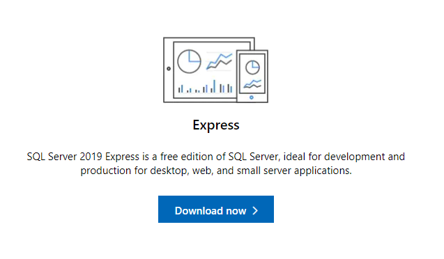
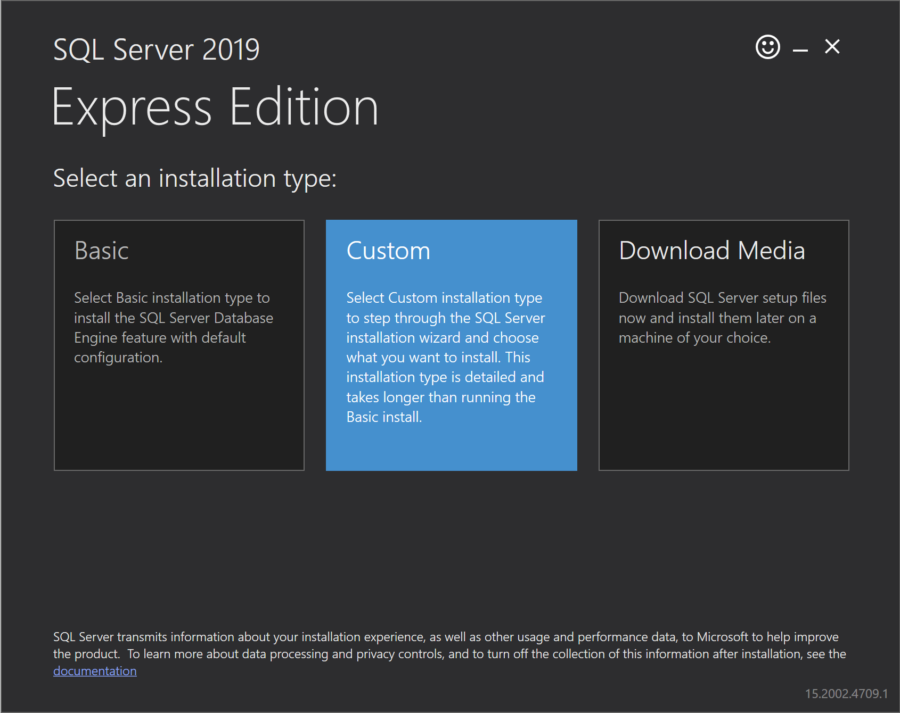
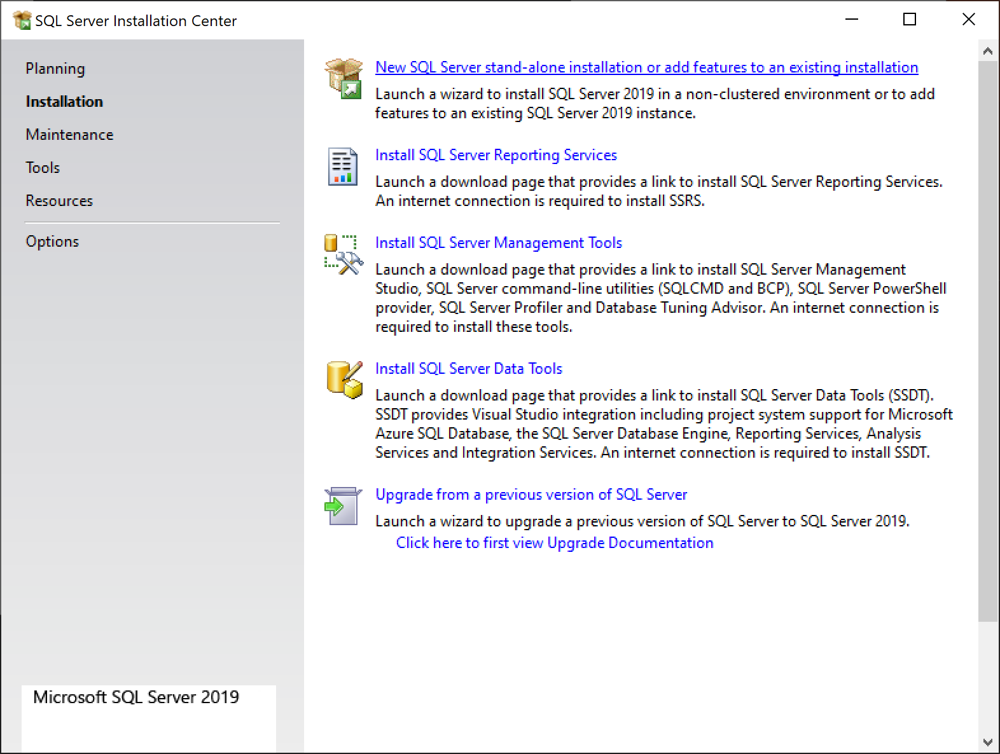
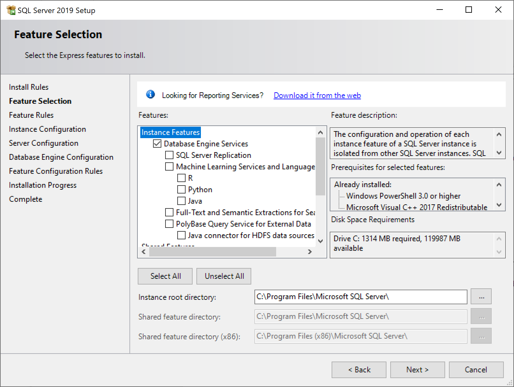
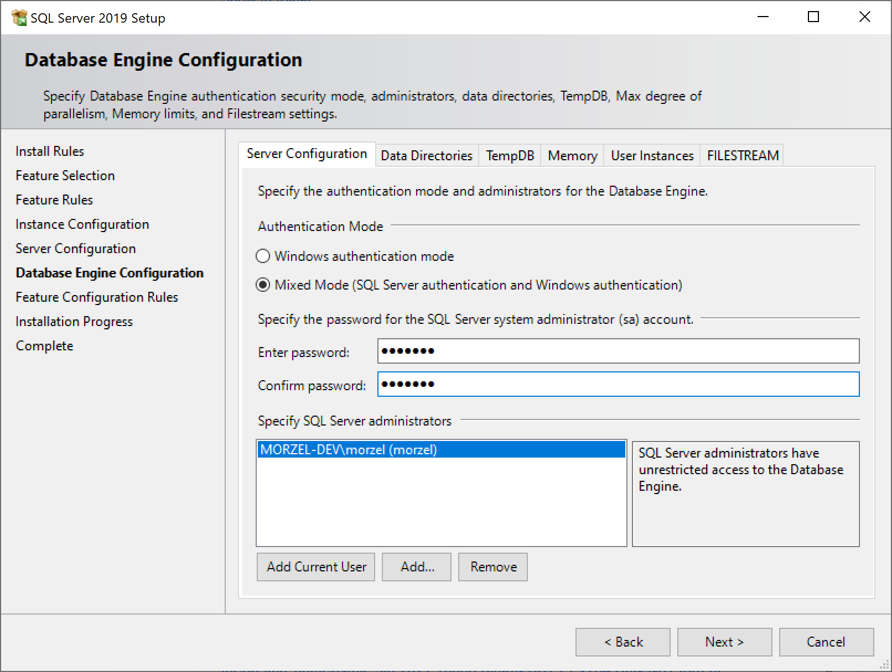
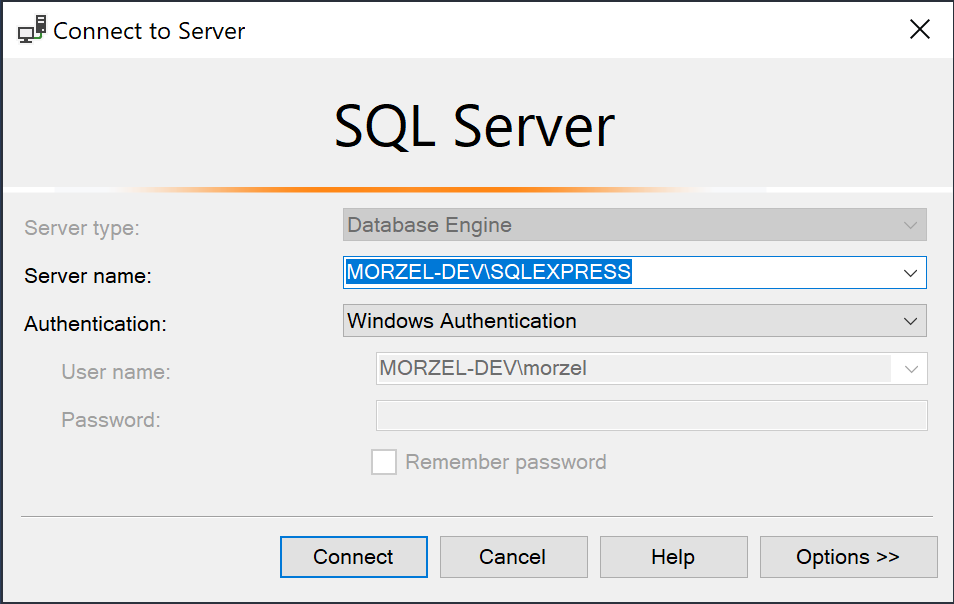
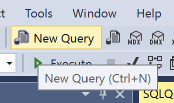

# SQL Server Development Environment With SQL Server Management Studio (SSMS)

## Install SQL Server

*Note: When you don't see the given step on the list below, just click on next. You know: next-next-next finish :D.*

- Navigate to https://www.microsoft.com/en-gb/sql-server/sql-server-downloads
- Choose Express Edition 
- Start the installation and choose Custom Install 
- New standalone installation. We will keep everything on default, except the logins. 
- Feature selection: if you want to go with the very basics, uncheck all options under Database Engine Services but keep it checked. 
- Most important part: At Database Engine Configuration, choose mixed mode and set-up a System Administrator password. So that, you will have a password login and a Windows Authenticated login as well. 
- A couple of nexts and a finish button if the installer prompts.

At this point, you have an SQL Server installation on your computer. You have two different login methods to authenticate: by password or by using your Windows Authentication. 

**For a learning project, I would preferal Windows Authentication.**

## Install Sql Server Management Studio (SSMS)

At the previous step, we have installed and configured our database engine. Now, we set-up an IDE that can maximize our productivity for using SQL Server.
 
- Navigate to https://docs.microsoft.com/en-us/sql/ssms/download-sql-server-management-studio-ssms
- Click on Download SSMQ. The newvest version will be on the top of the page.
- Install it. Nothing special, just the standard next-next-next-finish process.

## Try out our development environment

- Start SQL Server Managment Studio (SSMS)
- It pops out a login window. The server name will be your computer name, a backslash and your instance name. In my case, it will be MORZEL-DEV\SQLEXPRESS. For Authentication, choose Windows Authentication 
- Click on the New Query icon 



In the Query Editor window, type the following and press F5 to run the query: 
```sql
    select @@version
```

If you get something like that, everyting works fine:
```
Microsoft SQL Server 2019 (RTM) - 15.0.2000.5 (X64)   Sep 24 2019 13:48:23   Copyright (C) 2019 Microsoft Corporation  Express Edition (64-bit) on Windows 10 Pro 10.0 <X64> (Build 19041: ) (Hypervisor) 
```
